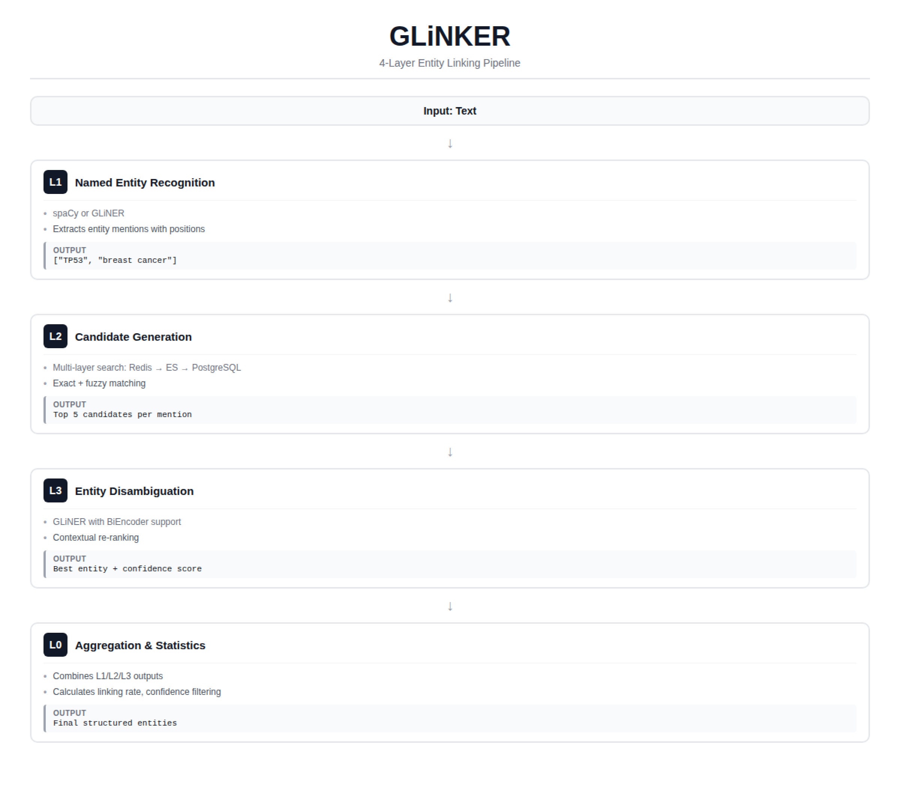

# GLiNKER - Entity Linking Framework

<div align="center">
    <div>
        <a href="https://arxiv.org/abs/2406.12925"></a>
        <a href="https://discord.gg/HbW9aNJ9"></a>
        <a href="https://hf.co/collections/knowledgator/gliner-linker"></a>
        <a href="https://www.apache.org/licenses/LICENSE-2.0"></a>
        <a href="https://pypi.org/project/glinker/"></a>
    </div>
    <br>
</div>


> A modular, production-ready entity linking framework combining NER, multi-layer database search, and neural entity disambiguation.

## Overview

GLiNKER is a modular entity linking pipeline that transforms raw text into structured, disambiguated entity mentions. It's designed for:

- **Production use**: Multi-layer caching (Redis → Elasticsearch → PostgreSQL)
- **Research flexibility**: Fully configurable YAML pipelines
- **Performance**: Embedding precomputation for BiEncoder models
- **Scalability**: DAG-based execution with batch processing

GLiNKER is built around GLiNER — a family of lightweight, generalist models for information extraction. It brings several key advantages to the entity linking pipeline:

- **Zero-shot recognition** — Identify any entity type by simply providing label names. No fine-tuning or annotated data required. Switch from biomedical genes to legal entities by changing a list of strings.
- **Unified architecture** — A single model handles both NER (L1) and entity disambiguation (L3/L4), reducing deployment complexity and keeping the inference stack consistent.
- **Efficient BiEncoder support** — BiEncoder variants allow precomputing label embeddings once and reusing them across millions of documents, delivering 10–100× speedups for large-scale linking.
- **Compact and fast** — Base models are small enough to run on CPU, while larger variants scale with GPU for production throughput.
- **Open and extensible** — Apache 2.0 licensed models on Hugging Face, easy to swap for domain-specific fine-tunes when needed.

### Models
#### NER (L1)
| Model name | Params | Text Encoder | Label Encoder | Avg. CrossNER | Inference Speed (H100, ex/s) | Inference Speed (pre-computed) |
|------------|--------|--------------|---------------|---------------|------------------------------|--------------------------------|
| [gliner-bi-edge-v2.0](https://huggingface.co/knowledgator/gliner-bi-edge-v2.0) | 60 M | [ettin-encoder-32m](https://huggingface.co/jhu-clsp/ettin-encoder-32m) | [all-MiniLM-L6-v2](https://huggingface.co/sentence-transformers/all-MiniLM-L6-v2) | 54.0% | 13.64 | 24.62 |
| [gliner-bi-small-v2.0](https://huggingface.co/knowledgator/gliner-bi-small-v2.0) | 108 M | [ettin-encoder-68m](https://huggingface.co/jhu-clsp/ettin-encoder-68m) | [all-MiniLM-L12-v2](https://huggingface.co/sentence-transformers/all-MiniLM-L12-v2) | 57.2% | 7.99 | 15.22 |
| [gliner-bi-base-v2.0](https://huggingface.co/knowledgator/gliner-bi-base-v2.0) | 194 M | [ettin-encoder-150m](https://huggingface.co/jhu-clsp/ettin-encoder-150m) | [bge-small-en-v1.5](https://huggingface.co/BAAI/bge-small-en-v1.5) | 60.3% | 5.91 | 9.51 |
| [gliner-bi-large-v2.0](https://huggingface.co/knowledgator/gliner-bi-large-v2.0) | 530 M | [ettin-encoder-400m](https://huggingface.co/jhu-clsp/ettin-encoder-400m) | [bge-base-en-v1.5](https://huggingface.co/BAAI/bge-base-en-v1.5) | 61.5% | 2.68 | 3.60 |


#### Linking (L3)
| Model | Base Encoder | Use Case |
|-------|--------------|----------|
| [gliner-linker-base-v1.0](https://huggingface.co/knowledgator/gliner-linker-base-v1.0) | deberta-base | Balanced performance |
| [gliner-linker-large-v1.0](https://huggingface.co/knowledgator/gliner-linker-large-v1.0) | deberta-large | Maximum accuracy |

#### Reranking (L4)
| Model | Base Encoder | Use Case |
|-------|--------------|----------|
| [gliner-linker-rerank-v1.0](https://huggingface.co/knowledgator/gliner-linker-rerank-v1.0) | ettin-encoder-68m | Reranking |

### Traditional vs GLiNKER Approach

```python
# Traditional approach: Complex, coupled code
ner_results = spacy_model(text)
candidates = search_database(ner_results)
linked = gliner_model.disambiguate(candidates)
# Mix of models, databases, and business logic

# GLiNKER approach: Declarative configuration
from glinker import ConfigBuilder, DAGExecutor

builder = ConfigBuilder(name="biomedical_el")
builder.l1.gliner(model="knowledgator/gliner-bi-base-v2.0", labels=["gene", "protein", "disease"])
builder.l2.add("redis", priority=2).add("postgres", priority=0)
builder.l3.configure(model="knowledgator/gliner-linker-large-v1.0")

executor = DAGExecutor(builder.get_config())
result = executor.execute({"texts": ["CRISPR-Cas9 enables precise gene therapy"]})
```

## Table of Contents

- [Quick Start](#quick-start)
- [Creating Pipelines](#creating-pipelines)
  - [Option 1: create_simple (recommended start)](#option-1-create_simple-recommended-start)
  - [Option 2: From a YAML config file](#option-2-from-a-yaml-config-file)
  - [Option 3: ConfigBuilder (programmatic)](#option-3-configbuilder-programmatic)
- [Loading Entities](#loading-entities)
  - [From a JSONL file](#from-a-jsonl-file)
  - [From a Python list](#from-a-python-list)
  - [From a Python dict](#from-a-python-dict)
  - [Entity format reference](#entity-format-reference)
- [Architecture](#architecture)
- [Features](#features)
- [YAML Configuration Reference](#yaml-configuration-reference)
- [Advanced Features](#advanced-features)
- [Database Setup](#database-setup)
- [Testing](#testing)
- [Citations](#citations)

## Quick Start

### Installation

Install easily using pip:

```bash
pip install git+https://github.com/Knowledgator/GLinker.git
```

Or install from source for development purposes:

```bash
git clone https://github.com/Knowledgator/GLinker.git
cd GLinker
pip install -e .

# With optional dependencies
pip install -e ".[dev,demo]"
```

### 30-Second Example

```python
from glinker import ConfigBuilder, DAGExecutor

# 1. Build configuration
builder = ConfigBuilder(name="demo")
builder.l1.spacy(model="en_core_web_sm")
builder.l3.configure(model="knowledgator/gliner-linker-large-v1.0")

# 2. Create executor
executor = DAGExecutor(builder.get_config())

# 3. Load entities
executor.load_entities("data/entities.jsonl", target_layers=["dict"])

# 4. Process text
result = executor.execute({
    "texts": ["Farnese Palace is one of the most important palaces in the city of Rome."]
})

# 5. Get results
l0_result = result.get("l0_result")
for entity in l0_result.entities:
    if entity.linked_entity:
        print(f"{entity.mention_text} → {entity.linked_entity.label}")
        print(f"  Confidence: {entity.linked_entity.score:.3f}")
```

**Output:**
```
BRCA1 → BRCA1: Breast cancer type 1 susceptibility protein
  Confidence: 0.923
breast cancer → Breast Cancer: Malignant neoplasm of the breast
  Confidence: 0.887
```

---

## Creating Pipelines

GLiNKER offers three ways to create a pipeline, from simplest to most configurable.

### Option 1: `create_simple` (recommended start)

`ProcessorFactory.create_simple` builds a **L2 → L3 → L0** pipeline in one call. No NER step — the model links entities directly from the input text against all loaded entities.

```python
from glinker import ProcessorFactory

# Minimal — just a model name
executor = ProcessorFactory.create_simple(
    model_name="knowledgator/gliner-bi-base-v2.0",
    threshold=0.5,
)

# Load entities and run
executor.load_entities("data/entities.jsonl")
result = executor.execute({"texts": ["CRISPR-Cas9 enables precise gene therapy."]})
```

**With inline entities (no file needed):**

```python
executor = ProcessorFactory.create_simple(
    model_name="knowledgator/gliner-bi-base-v2.0",
    threshold=0.5,
    entities=[
        {"entity_id": "Q101", "label": "insulin", "description": "Peptide hormone regulating blood glucose"},
        {"entity_id": "Q102", "label": "glucose", "description": "Primary blood sugar and key metabolic fuel"},
        {"entity_id": "Q103", "label": "GLUT4", "description": "Insulin-responsive glucose transporter in muscle and adipose tissue"},
        {"entity_id": "Q104", "label": "pancreatic beta cell", "description": "Endocrine cell type that secretes insulin"},
    ],
)

result = executor.execute({
    "texts": [
        "After a meal, pancreatic beta cells release insulin, which promotes GLUT4 translocation and increases glucose uptake in muscle."
    ]
})
```

**With a reranker (L2 → L3 → L4 → L0):**

```python
executor = ProcessorFactory.create_simple(
    model_name="knowledgator/gliner-bi-base-v2.0",
    threshold=0.5,
    reranker_model="knowledgator/gliner-multitask-large-v0.5",
    reranker_max_labels=20,
    reranker_threshold=0.3,
    entities="data/entities.jsonl",
    precompute_embeddings=True,
)
```

**With entity descriptions in the template:**

```python
executor = ProcessorFactory.create_simple(
    model_name="knowledgator/gliner-bi-base-v2.0",
    template="{label}: {description}",  # L3 sees "BRCA1: Breast cancer type 1 susceptibility protein"
    entities="data/entities.jsonl",
)
```

**All `create_simple` parameters:**

| Parameter | Default | Description |
|-----------|---------|-------------|
| `model_name` | *(required)* | HuggingFace model ID or local path |
| `device` | `"cpu"` | Torch device (`"cpu"`, `"cuda"`, `"cuda:0"`) |
| `threshold` | `0.5` | Minimum score for entity predictions |
| `template` | `"{label}"` | Format string for entity labels (e.g. `"{label}: {description}"`) |
| `max_length` | `512` | Max sequence length for tokenization |
| `token` | `None` | HuggingFace auth token for gated models |
| `entities` | `None` | Entity data to load immediately (file path, list of dicts, or dict of dicts) |
| `precompute_embeddings` | `False` | Pre-embed all entity labels after loading (BiEncoder only) |
| `verbose` | `False` | Enable verbose logging |
| `reranker_model` | `None` | GLiNER model for L4 reranking (adds L4 node when set) |
| `reranker_max_labels` | `20` | Max candidate labels per L4 inference call |
| `reranker_threshold` | `None` | Score threshold for L4 (defaults to `threshold`) |

### Option 2: From a YAML config file

For full control over every layer, define the pipeline in YAML and load it:

```python
from glinker import ProcessorFactory

executor = ProcessorFactory.create_pipeline("configs/pipelines/dict/simple.yaml")
executor.load_entities("data/entities.jsonl")
result = executor.execute({"texts": ["TP53 mutations cause cancer"]})
```

See [YAML Configuration Reference](#yaml-configuration-reference) for full config examples.

### Option 3: `ConfigBuilder` (programmatic)

Build configs in Python with full control over each layer:

```python
from glinker import ConfigBuilder, DAGExecutor

builder = ConfigBuilder(name="my_pipeline")
builder.l1.gliner(model="knowledgator/gliner-bi-base-v2.0", labels=["gene", "disease"])
builder.l3.configure(model="knowledgator/gliner-linker-large-v1.0")

executor = DAGExecutor(builder.get_config())
executor.load_entities("data/entities.jsonl", target_layers=["dict"])
```

**With multiple database layers:**

```python
builder = ConfigBuilder(name="production")
builder.l1.gliner(model="knowledgator/gliner-bi-base-v2.0", labels=["gene", "protein"])
builder.l2.add("redis", priority=2, ttl=3600)
builder.l2.add("elasticsearch", priority=1, ttl=86400)
builder.l2.add("postgres", priority=0)
builder.l3.configure(model="knowledgator/gliner-linker-large-v1.0", use_precomputed_embeddings=True)
builder.l0.configure(strict_matching=True, min_confidence=0.3)
builder.save("config.yaml")
```

**With L4 reranker:**

```python
builder = ConfigBuilder(name="reranked")
builder.l1.gliner(model="knowledgator/gliner-bi-base-v2.0", labels=["gene", "disease"])
builder.l3.configure(model="knowledgator/gliner-linker-base-v1.0")
builder.l4.configure(
    model="knowledgator/gliner-linker-rerank-v1.0",
    threshold=0.3,
    max_labels=20,
)
builder.save("config.yaml")  # Generates L1 → L2 → L3 → L4 → L0
```

---

## Loading Entities

Entities can be loaded after pipeline creation via `executor.load_entities()`, or passed directly to `create_simple(entities=...)`. Three input formats are supported.

### From a JSONL file

One JSON object per line:

```python
executor.load_entities("data/entities.jsonl")

# Or target specific database layers
executor.load_entities("data/entities.jsonl", target_layers=["dict", "postgres"])
```

**`data/entities.jsonl`:**

```jsonl
{"entity_id": "Q123", "label": "Kyiv", "description": "Capital and largest city of Ukraine", "entity_type": "city", "popularity": 1000000, "aliases": ["Kiev"]}
{"entity_id": "Q456", "label": "Dnipro River", "description": "Major river flowing through Ukraine and Belarus", "entity_type": "river", "popularity": 950000, "aliases": ["Dnieper"]}
{"entity_id": "Q789", "label": "Carpathian Mountains", "description": "Mountain range in Central and Eastern Europe", "entity_type": "mountain_range", "popularity": 800000, "aliases": ["Carpathians"]}
```

### From a Python list

```python
entities = [
    {
        "entity_id": "Q123",
        "label": "Kyiv",
        "description": "Capital and largest city of Ukraine",
        "entity_type": "city",
        "aliases": ["Kiev"],
    },
    {
        "entity_id": "Q456",
        "label": "Dnipro River",
        "description": "Major river flowing through Ukraine and Belarus",
        "entity_type": "river",
        "aliases": ["Dnieper"],
    },
]

executor.load_entities(entities)
```

### From a Python dict

Keys are entity IDs, values are entity data:

```python
entities = {
    "Q123": {
        "label": "Kyiv",
        "description": "Capital and largest city of Ukraine",
        "entity_type": "city",
    },
    "Q456": {
        "label": "Dnipro River",
        "description": "Major river flowing through Ukraine and Belarus",
        "entity_type": "river",
    },
}

executor.load_entities(entities)
```


### Entity format reference

| Field | Type | Required | Default | Description |
|-------|------|----------|---------|-------------|
| `entity_id` | str | **yes** | — | Unique identifier |
| `label` | str | **yes** | — | Primary name |
| `description` | str | no | `""` | Text description (used in templates like `"{label}: {description}"`) |
| `entity_type` | str | no | `""` | Category (e.g. `"gene"`, `"disease"`) |
| `aliases` | list[str] | no | `[]` | Alternative names for search matching |
| `popularity` | int | no | `0` | Ranking score for candidate ordering |

---

## Architecture

GLiNKER uses a **layered pipeline** with an optional reranking stage:



| Layer | Purpose | Processor |
|-------|---------|-----------|
| **L1** | Mention extraction (spaCy or GLiNER NER) | `l1_spacy`, `l1_gliner` |
| **L2** | Candidate retrieval from database layers | `l2_chain` |
| **L3** | Entity disambiguation via GLiNER | `l3_batch` |
| **L4** | *(Optional)* GLiNER reranking with candidate chunking | `l4_reranker` |
| **L0** | Aggregation, filtering, and final output | `l0_aggregator` |

**Supported topologies:**
```
Full pipeline:       L1 → L2 → L3 → L0
With reranking:      L1 → L2 → L3 → L4 → L0
Simple (no NER):          L2 → L3 → L0
Simple + reranker:        L2 → L4 → L0
```

**Key Concepts:**

- **DAG Execution**: Layers execute in dependency order with automatic data flow
- **Component-Processor Pattern**: Each layer has a Component (methods) and Processor (orchestration)
- **Schema Consistency**: Single template (e.g., `"{label}: {description}"`) across layers
- **Cache Hierarchy**: Upper layers cache results from lower layers automatically

---

## Features

### Multiple NER Backends
- **spaCy** — Fast, rule-based NER for standard use cases
- **GLiNER** — Neural NER with custom labels (no training required)

### Multi-Layer Database Support
- **Dict** — In-memory (perfect for demos)
- **Redis** — Fast cache (production)
- **Elasticsearch** — Full-text search with fuzzy matching
- **PostgreSQL** — Persistent storage with pg_trgm fuzzy search

### Performance Optimization
- **Embedding Precomputation** — Cache label embeddings for BiEncoder models
- **Cache Hierarchy** — Automatic write-back: Redis → ES → PostgreSQL
- **Batch Processing** — Efficient parallel processing

### L4 Reranker (Optional)

When the candidate set from L2 is large (tens or hundreds of entities), a single GLiNER call may be impractical. The **L4 reranker** solves this by splitting candidates into chunks:

```
100 candidates, max_labels=20  →  5 GLiNER inference calls
Results merged, deduplicated, filtered by threshold
```

L4 uses a **uni-encoder GLiNER model** and can be placed after L3 (true reranking) or used directly after L2 (replacing L3):

```python
# Via ConfigBuilder
builder.l4.configure(
    model="knowledgator/gliner-multitask-large-v0.5",
    threshold=0.3,
    max_labels=20   # candidates per inference call
)

# Via create_simple
executor = ProcessorFactory.create_simple(
    model_name="knowledgator/gliner-bi-base-v2.0",
    reranker_model="knowledgator/gliner-multitask-large-v0.5",
    reranker_max_labels=20,
)
```

---

## YAML Configuration Reference

YAML configs give full control over every node in the pipeline. Load them with:

```python
from glinker import ProcessorFactory

executor = ProcessorFactory.create_pipeline("path/to/config.yaml")
```

### Simple pipeline (L2 → L3 → L0, no NER)

Equivalent to `create_simple`. No L1 node — texts are passed directly to L2/L3:

```yaml
name: "simple"
description: "Simple pipeline - L3 only with entity database"

nodes:
  - id: "l2"
    processor: "l2_chain"
    inputs:
      texts:
        source: "$input"
        fields: "texts"
    output:
      key: "l2_result"
    schema:
      template: "{label}"
    config:
      max_candidates: 30
      min_popularity: 0
      layers:
        - type: "dict"
          priority: 0
          write: true
          search_mode: ["exact"]

  - id: "l3"
    processor: "l3_batch"
    requires: ["l2"]
    inputs:
      texts:
        source: "$input"
        fields: "texts"
      candidates:
        source: "l2_result"
        fields: "candidates"
    output:
      key: "l3_result"
    schema:
      template: "{label}"
    config:
      model_name: "knowledgator/gliner-bi-base-v2.0"
      device: "cpu"
      threshold: 0.5
      flat_ner: true
      multi_label: false
      use_precomputed_embeddings: true
      cache_embeddings: false
      max_length: 512

  - id: "l0"
    processor: "l0_aggregator"
    requires: ["l2", "l3"]
    inputs:
      l2_candidates:
        source: "l2_result"
        fields: "candidates"
      l3_entities:
        source: "l3_result"
        fields: "entities"
    output:
      key: "l0_result"
    config:
      strict_matching: false
      min_confidence: 0.0
      include_unlinked: true
      position_tolerance: 2
```

### Full pipeline with spaCy NER (L1 → L2 → L3 → L0)

```yaml
name: "dict_default"
description: "In-memory dict layer with spaCy NER"

nodes:
  - id: "l1"
    processor: "l1_spacy"
    inputs:
      texts:
        source: "$input"
        fields: "texts"
    output:
      key: "l1_result"
    config:
      model: "en_core_sci_sm"
      device: "cpu"
      batch_size: 1
      min_entity_length: 2
      include_noun_chunks: true

  - id: "l2"
    processor: "l2_chain"
    requires: ["l1"]
    inputs:
      mentions:
        source: "l1_result"
        fields: "entities"
    output:
      key: "l2_result"
    schema:
      template: "{label}: {description}"
    config:
      max_candidates: 5
      layers:
        - type: "dict"
          priority: 0
          write: true
          search_mode: ["exact", "fuzzy"]
          fuzzy:
            max_distance: 64
            min_similarity: 0.6

  - id: "l3"
    processor: "l3_batch"
    requires: ["l2"]
    inputs:
      texts:
        source: "$input"
        fields: "texts"
      candidates:
        source: "l2_result"
        fields: "candidates"
    output:
      key: "l3_result"
    schema:
      template: "{label}: {description}"
    config:
      model_name: "knowledgator/gliner-linker-large-v1.0"
      device: "cpu"
      threshold: 0.5
      flat_ner: true
      multi_label: false
      max_length: 512

  - id: "l0"
    processor: "l0_aggregator"
    requires: ["l1", "l2", "l3"]
    inputs:
      l1_entities:
        source: "l1_result"
        fields: "entities"
      l2_candidates:
        source: "l2_result"
        fields: "candidates"
      l3_entities:
        source: "l3_result"
        fields: "entities"
    output:
      key: "l0_result"
    config:
      strict_matching: true
      min_confidence: 0.0
      include_unlinked: true
      position_tolerance: 2
```

### Pipeline with L4 reranker (L1 → L2 → L3 → L4 → L0)

Use when the candidate set is large. L4 splits candidates into chunks of `max_labels` and runs GLiNER inference on each chunk:

```yaml
name: "dict_reranker"
description: "In-memory dict with L4 GLiNER reranking"

nodes:
  - id: "l1"
    processor: "l1_gliner"
    inputs:
      texts:
        source: "$input"
        fields: "texts"
    output:
      key: "l1_result"
    config:
      model: "knowledgator/gliner-bi-base-v2.0"
      labels: ["gene", "drug", "disease", "person", "organization"]
      device: "cpu"

  - id: "l2"
    processor: "l2_chain"
    requires: ["l1"]
    inputs:
      mentions:
        source: "l1_result"
        fields: "entities"
    output:
      key: "l2_result"
    schema:
      template: "{label}: {description}"
    config:
      max_candidates: 100
      layers:
        - type: "dict"
          priority: 0
          write: true
          search_mode: ["exact", "fuzzy"]

  - id: "l3"
    processor: "l3_batch"
    requires: ["l1", "l2"]
    inputs:
      texts:
        source: "$input"
        fields: "texts"
      candidates:
        source: "l2_result"
        fields: "candidates"
    output:
      key: "l3_result"
    schema:
      template: "{label}: {description}"
    config:
      model_name: "knowledgator/gliner-linker-base-v1.0"
      device: "cpu"
      threshold: 0.5
      use_precomputed_embeddings: true

  - id: "l4"
    processor: "l4_reranker"
    requires: ["l1", "l2", "l3"]
    inputs:
      texts:
        source: "$input"
        fields: "texts"
      candidates:
        source: "l2_result"
        fields: "candidates"
      l1_entities:
        source: "l1_result"
        fields: "entities"
    output:
      key: "l4_result"
    schema:
      template: "{label}: {description}"
    config:
      model_name: "knowledgator/gliner-multitask-large-v0.5"
      device: "cpu"
      threshold: 0.3
      max_labels: 20          # candidates per inference call

  - id: "l0"
    processor: "l0_aggregator"
    requires: ["l1", "l2", "l4"]
    inputs:
      l1_entities:
        source: "l1_result"
        fields: "entities"
      l2_candidates:
        source: "l2_result"
        fields: "candidates"
      l3_entities:
        source: "l4_result"   # L0 reads from L4 instead of L3
        fields: "entities"
    output:
      key: "l0_result"
    config:
      strict_matching: true
      min_confidence: 0.0
      include_unlinked: true
```

### Simple pipeline with reranker only (L2 → L4 → L0, no L1/L3)

Skips both NER and L3 — L4 handles entity linking directly with chunked inference:

```yaml
name: "simple_reranker"
description: "Simple pipeline with L4 reranker - no L1 or L3"

nodes:
  - id: "l2"
    processor: "l2_chain"
    inputs:
      texts:
        source: "$input"
        fields: "texts"
    output:
      key: "l2_result"
    schema:
      template: "{label}: {description}"
    config:
      max_candidates: 100
      layers:
        - type: "dict"
          priority: 0
          write: true
          search_mode: ["exact"]

  - id: "l4"
    processor: "l4_reranker"
    requires: ["l2"]
    inputs:
      texts:
        source: "$input"
        fields: "texts"
      candidates:
        source: "l2_result"
        fields: "candidates"
    output:
      key: "l4_result"
    schema:
      template: "{label}: {description}"
    config:
      model_name: "knowledgator/gliner-multitask-large-v0.5"
      device: "cpu"
      threshold: 0.5
      max_labels: 20

  - id: "l0"
    processor: "l0_aggregator"
    requires: ["l2", "l4"]
    inputs:
      l2_candidates:
        source: "l2_result"
        fields: "candidates"
      l3_entities:
        source: "l4_result"
        fields: "entities"
    output:
      key: "l0_result"
    config:
      strict_matching: false
      min_confidence: 0.0
      include_unlinked: true
```

### Production config with multiple database layers

```yaml
name: "production_pipeline"

nodes:
  - id: "l2"
    processor: "l2_chain"
    config:
      layers:
        - type: "redis"
          priority: 2
          ttl: 3600
        - type: "elasticsearch"
          priority: 1
          ttl: 86400
        - type: "postgres"
          priority: 0
```

---

## Use Cases

### Biomedical Text Mining
```python
builder.l1.gliner(
    model="knowledgator/gliner-bi-base-v2.0",
    labels=["gene", "protein", "disease", "drug", "chemical"]
)
```

### News Article Analysis
```python
builder.l1.spacy(model="en_core_web_lg")
# Link to Wikidata/Wikipedia entities
```

### Clinical NLP
```python
builder.l1.gliner(
    model="knowledgator/gliner-bi-base-v2.0",
    labels=["symptom", "diagnosis", "medication", "procedure"]
)
```

---

## Advanced Features

### Precomputed Embeddings (BiEncoder)

For BiEncoder models, precomputing label embeddings gives 10–100× speedups:

```python
# Load entities, then precompute
executor.load_entities("data/entities.jsonl")
executor.precompute_embeddings(batch_size=64)

# Or do both in create_simple
executor = ProcessorFactory.create_simple(
    model_name="knowledgator/gliner-bi-base-v2.0",
    entities="data/entities.jsonl",
    precompute_embeddings=True,
)
```

### On-the-Fly Embedding Caching

Instead of precomputing all embeddings upfront, cache them as they are computed during inference:

```python
builder.l3.configure(
    model="knowledgator/gliner-linker-large-v1.0",
    cache_embeddings=True,
)
```

### Custom Pipelines

```python
# Custom L1 processing pipeline
l1_processor = processor_registry.get("l1_spacy")(
    config_dict={"model": "en_core_sci_sm"},
    pipeline=[
        ("extract_entities", {}),
        ("filter_by_length", {"min_length": 3}),
        ("deduplicate", {}),
        ("sort_by_position", {})
    ]
)
```

---

## Database Setup

### Quick Start (Docker)
```bash
# Start all databases
cd scripts/database
docker-compose up -d

# Load entities
python scripts/database/setup_all.sh
```

### Manual Setup
```python
from glinker import DAGExecutor

executor = DAGExecutor(pipeline)
executor.load_entities(
    filepath="data/entities.jsonl",
    target_layers=["redis", "elasticsearch", "postgres"],
    batch_size=1000
)
```

---

## Testing

```bash
# Run all tests
pytest

# Run specific layer tests
pytest tests/l1/
pytest tests/l2/

# Run with coverage
pytest --cov=glinker --cov-report=html
```

## Citations

If you find GLiNKER useful in your research, please consider citing our papers:

```bibtex
@misc{stepanov2024glinermultitaskgeneralistlightweight,
      title={GLiNER multi-task: Generalist Lightweight Model for Various Information Extraction Tasks},
      author={Ihor Stepanov and Mykhailo Shtopko},
      year={2024},
      eprint={2406.12925},
      archivePrefix={arXiv},
      primaryClass={cs.LG},
      url={https://arxiv.org/abs/2406.12925},
}
```

## Contributing

We welcome contributions! Areas of interest:

- **Database layers** (MongoDB, Neo4j, vector databases)
- **Performance optimizations**
- **Documentation improvements**

## License

Apache 2.0 License — see [LICENSE](LICENSE) file for details.

## Acknowledgments

- **GLiNER** — Zero-shot NER and entity linking ([urchade/GLiNER](https://github.com/urchade/GLiNER))
- **spaCy** — Industrial-strength NLP ([explosion/spaCy](https://github.com/explosion/spaCy))

## Contact

- **GitHub**: [Knowledgator/GLinker](https://github.com/Knowledgator/GLinker)
- **Email**: info@knowledgator.com

---

Developed by [Knowledgator](https://knowledgator.com)
